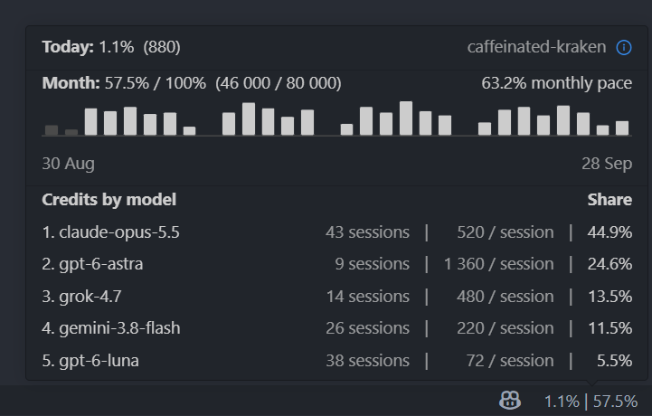

## Copilot Credits

Lightweight Copilot usage viewer for credit use from Copilot log files. Shows today's and this month's credit use, estimated monthly pace, last 30 days and credits by model. Runs locally.

## Reference

Reads Copilot's own log files. Sets:

- Copilot Chat's default log level trace, usage by date
- `github.copilot.chat.agentDebugLog.fileLogging.enabled`, credits by model
- `chat.agentHost.agentDebugLog.enabled`, for the agents window
